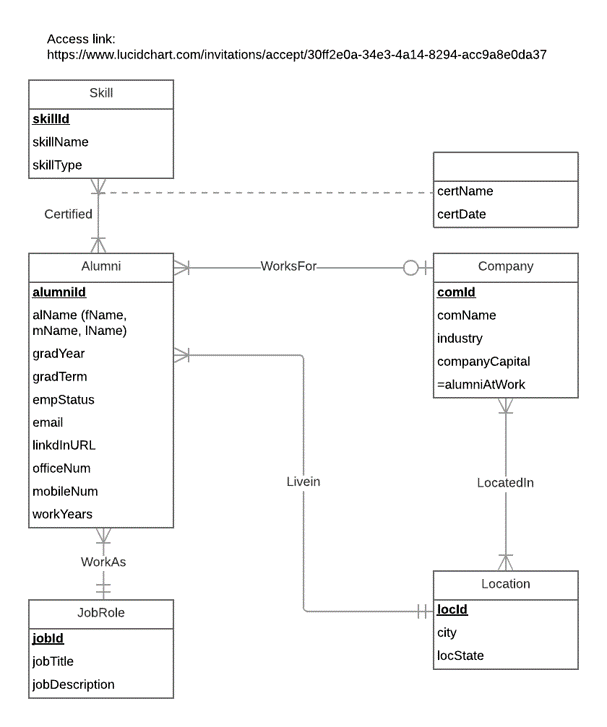
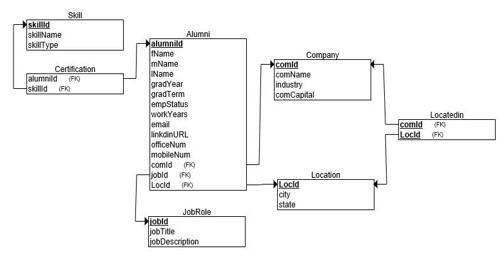
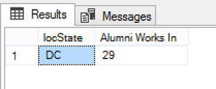
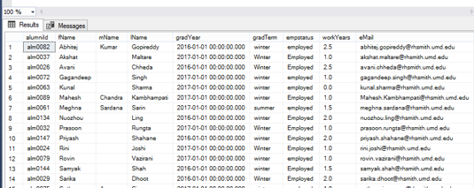
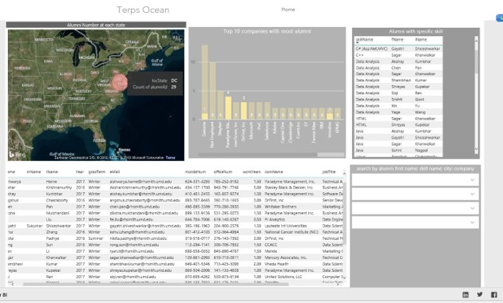
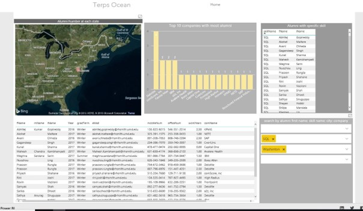

# Smith MSIS Alumni Contacts Information Database
The purpose of Terps Ocean’s database is to provide a well-organized cataloging system that accounts for the contact information of all the MS Information Systems alumni of University of Maryland Robert. H. Smith School of Business and meet various customer needs based on accurate and adequate data.

# Tools
Back-end:<br/>
- Excel: clean data<br/>
- Lucidchart: ER diagram<br/>
- SSMS: manage data<br/>

Front-end:<br/>
- Power BI: visualize data<br/>
- HTML: create website<br/>
- Wix: publish website<br/>

# Database Design
## 1.Database entities, attribute, and primary key:
(1) Alumni (alumniID, alName(fName, mName, lName), graduationYear, graduationTerm, employmentStatus, email, linkdInURL, officeNum, mobileNum)<br/>
(2) Company (companyID, companyName, industry, companyCapital, alumniAtwork) <br/>
(3) Job Role (jobID, JobTitle, workYears, jobDescription)<br/>
(4) Skill (skillId, skillName, skillType)<br/>
(5) Location (locationID, city, state, postalCode)<br/>
(6) Certificate (certificationName, certificationDate)<br/>

## 2.ERD


## 3.Relation Schema
Alumni (alumniId, fName, mName, lName, gradYear, gradTerm, workYears, email, linkedinURL, officeNum, mobileNum, comId, locId, jobId)<br/>
	Company (comId, comName, industry, comCapital)<br/>
	Location (locId, city, locState)<br/>
	Locatedin (comId, locId)<br/>
	JobRole (jobId, jobTitle, jobDescription)<br/>
	Skill (skillId, skillName, skillType)<br/>
	Certification (alumniId, skillId, certName, certDate)<br/>
  


## 4.Create Table (Sample)
```
CREATE TABLE [Certification] (
    alumniId CHAR (7) NOT NULL,
    skillId CHAR(8) Not Null,
    certName VARCHAR(MAX) Null,
    certDate Datetime Null,
    
    CONSTRAINT pk_Certification_alumniId_skillId PRIMARY KEY (alumniId,skillId),
    CONSTRAINT fk_Certification_alumniId FOREIGN KEY (alumniId)
        REFERENCES [Alumni](alumniId)
        ON DELETE NO ACTION ON UPDATE NO ACTION,
    CONSTRAINT fk_Certification_skillId FOREIGN KEY (skillId)
        REFERENCES [Skill](skillId)
        ON DELETE NO ACTION ON UPDATE NO ACTION);

```

# User Story
### 1. Which state has the most alumni working in, so that we can hold an alumni event in this state.
```
select top 1 l.locState, count(L.locState) as 'Alumni Works In'
from Location l, Alumni a
where l.locId=a.locId
group by l.locState
order by count(l.locState) desc;
```


### 2. Who has SQL skill in Washington DC, as well as their detailed information, so that we can invite them come to on-campus SQL workshop to share their experience.
```
select A.* 
from dbo.Alumni A,dbo.Location B, dbo.Certification as C, dbo.Skill as skill 
where A.locId=B.locId 
and A.alumniId=C.alumniId 
and C.skillId=skill.skillId
and B.locState='DC' 
and skill.skillName='SQL'
order by A.fName ASC, A.lName ASC
```


# Application
### 1. screenshot for user story 1



### 2. screenshot for user story 2





